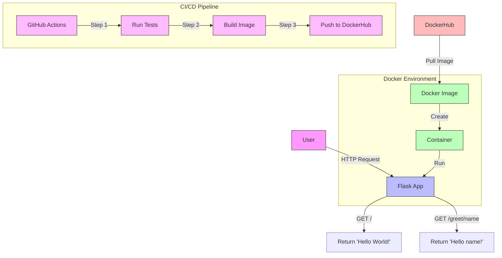

# 🚀 FlaskTest-App

This is a simple Flask-based web application that provides a basic "Hello World" endpoint and a dynamic greeting endpoint. The application is containerized using Docker and is available as a Docker image.


## ✨Features

- **Home Endpoint (`/`)🏠**: Returns "Hello World!".
- **Greet Endpoint (`/greet/<name>`)👋**: Returns a personalized greeting.


## 🛠️Installation and Usage

### 1. Run Locally

#### Prerequisites
- Python 3.12
- Flask (`pip install -r requirements.txt`)

#### Steps
1. Clone the repository:
```
git clone https://github.com/<your-repo>/flasktest-app.git
cd flasktest-app
```
2. Run the application:
```
cd src
python app.py
```
3. Open your browser and navigate to:
- Home:
```
http://127.0.0.1:5000/
```
- Greet:
```
http://127.0.0.1:5000/greet/<name>
```
### 2. 🐳Run Using Docker
Prerequisites
- Docker installed on your system.

Steps
1. Pull the Docker image:
```
docker pull rahulsamant37/flasktest-app
```
2. Run the container:
```
docker run -p 5000:5000 rahulsamant37/flasktest-app
```
3. Open your browser and navigate to:
- Home:
```
http://127.0.0.1:5000/
```
- Greet:
```
http://127.0.0.1:5000/greet/<name>
```
### 🧪Testing
#### Unit Tests
Unit tests have been implemented to verify the functionality of the endpoints. To run the tests:

1. Install pytest:
```
pip install pytest
```
2. Run the tests:
```
pytest test_app.py
```
### 🔄Workflow



### 🚂Continuous Integration and Deployment (CI/CD)
This project includes a CI/CD pipeline configuration to automate testing and deployment.

#### Features
- Unit Tests: The pipeline runs the unit tests to ensure code quality.
- Docker Build: The pipeline builds the Docker image.
- Deployment: Automatically pushes the Docker image to the Docker Hub repository rahulsamant37/flasktest-app.
#### Pipeline Configuration
The CI/CD workflow is configured using GitHub Actions. Ensure the following secrets are set up in your repository:

- DOCKER_USERNAME: Your Docker Hub username.
- DOCKER_PASSWORD: Your Docker Hub password or access token.
For more details, refer to .github/workflows/cicd.yml.

### 👨‍💻  Author
Rahul Samant
### 📞 Support
Having issues? Let us know!

- 🐛 Report bugs in the Issues section
- 💡 For feature requests, open a new issue with the "enhancement" label
- 📧 For direct support: [rahulsamantcoc2@gmail.com]

Remember to ⭐ this repository if you found it helpful!
